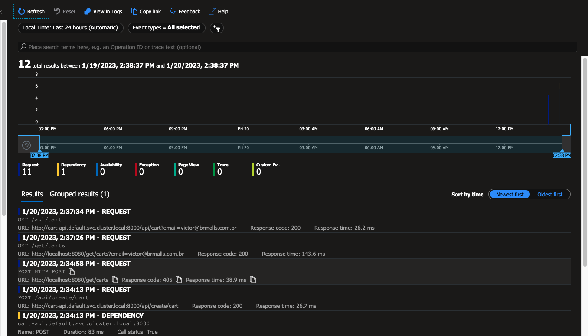

# otel-operator-azure-monito
## Steps to configure the operator and auto-instrumentation

1. Install certmanager:
    ```
    # kubectl apply -f https://github.com/cert-manager/cert-manager/releases/download/v1.11.0/cert-manager.yaml
    ```
2. Install the opentelemetry operator:

    ```
    # helm repo add open-telemetry https://open-telemetry.github.io/opentelemetry-helm-charts

    # helm repo update

    # helm install --namespace opentelemetry-operator-system opentelemetry-operator open-telemetry/opentelemetry-operator --create-namespace
    ```
3. Create an opentelemetry collector object in kubernetes
    
    **NOTE**: Replace the <INSTRUMENTATION_KEY> placeholder with your application insights instrumentation key that can be retrieved from azure portal:

    


    ```
    # kubectl apply -f azuremonitor-otel-collector.yml
    ```
4. Create the autoinstrumentation configuration

    ```
    # kubectl apply -f azuremonitor-autoinstrumentation.yml
    ```
5. Run the deployment with the opentelemetry annotation(In this example, we are using python):

    ```
    # kubectl apply -f example/app/cart-api.yml
    ```
6. Port forward the application and make an api call:

    ```
    # kubectl port-forward deployment.apps/cart-api 8080:8000

    # curl --location --request POST 'localhost:8080/api/create/cart' \
        --header 'Content-Type: application/json' \
        --data-raw '{
            "email": "myemail@email.com",
            "products": ["last of us part I"]
        }'
    ```
7. See the telemetry in azure application insights:

